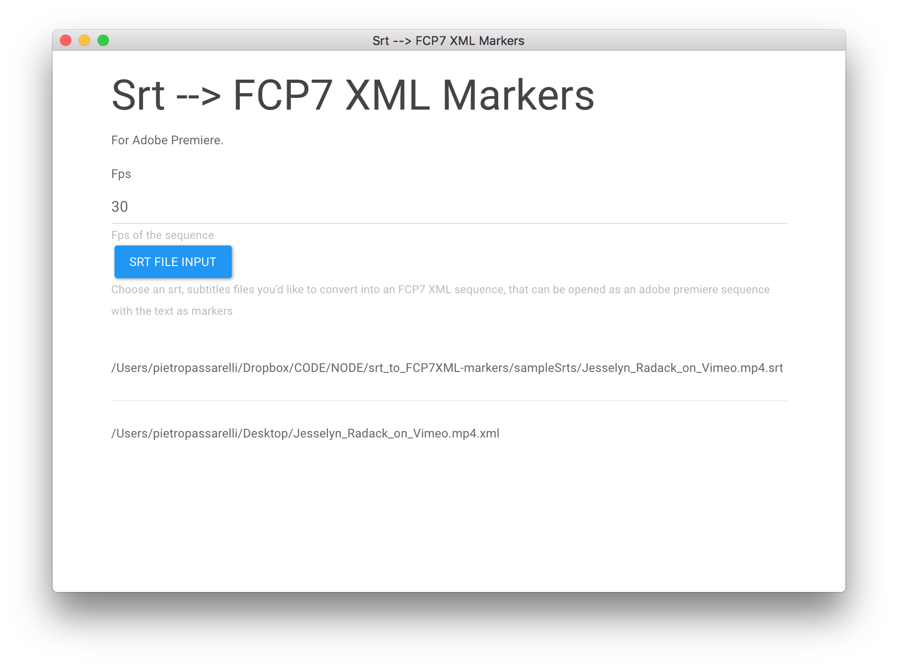
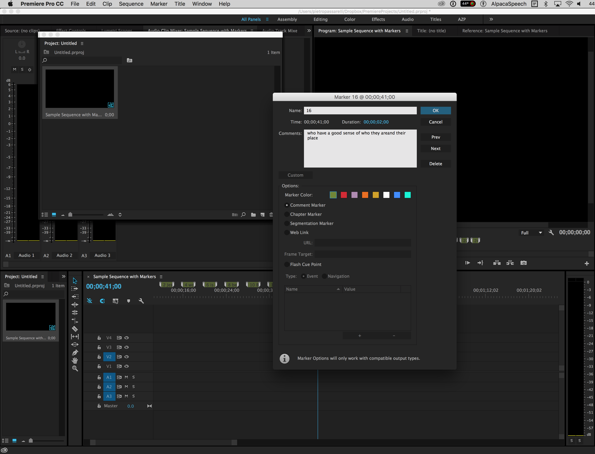

# `srt_to_FCP7XML-markers_electron` 

An electron mac os x desktop app to open an srt, subtitle file, and creates a sequence of markers with that text, that can be open in Adobe Premiere (FCP7 XML). App wraps around [srt_to_FCP7XML-markers](https://github.com/pietrop/srt_to_FCP7XML-markers) node module.

The porpuse of this is so that video sequences can be more easably searched for content using the associated transcriptions/captions/subtitles, within premire. Eg if you are a video editor looking for a specific sound bite.

## Disclaimer 

This is a quick hack work in progress, mainly to test out if it was technically possible, learn more about adding marker and manipulating FCP7 XML sequences programmatically as well as whether there is any interest in the project. 

## How to use 

- Get an srt file 
- Open the srt file with the app 
- when the app is done it save an xml (FCP7 XML) on your desktop, with the same name as the srt file. 

- open the XML in adobe premiere, or other editing software that supports FCP7 XML.

	- This should give you a sequence, when you double click on it, you shoudl see an "empty sequence" with markers. 
	- You can then add the original media file (audio or video) from which the srt, subtitle file, was created into the sequence.

## A note on video workflows

If you are looking to do a more involved text based video editing, I reccomend doing a rough assembly using [autoEdit](http://autoedit.io) 's [paper-editing funciton](https://pietropassarelli.gitbooks.io/autoedit2-user-manual/content/paperediting.html). For more on [what it is a paper-edit see here](https://pietropassarelli.gitbooks.io/how-to-tell-compelling-stories-out-of-video-inter/content/).

## Contributors 

- [Pietro](http://github.com/pietrop), [twitter](http://twitter.com/pietropassarell)

<!-- 
## Stack 

- [electron dialog](https://electronjs.org/docs/api/dialog)
- [bootswatch](https://bootswatch.com/)
- [on click listener](https://www.w3schools.com/js/js_htmldom_eventlistener.asp) -->